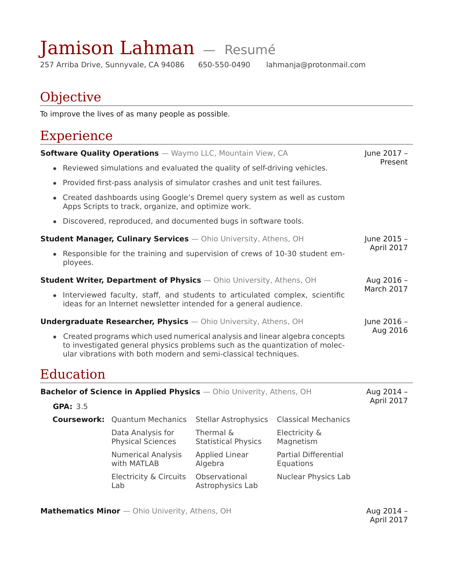

# Resume
## Personal resume in LaTeX and Open Document formats.
The cover letter is written in a plain text document to allow for easy changes as needed. Necessary, user-specific changes in ``/src/resume.tex`` are prefaced with comments of the format ``### <Information to add>``.

### Preview
<p align="left">

</p>

## Compiling files

```shell
bazel build src:all
```
